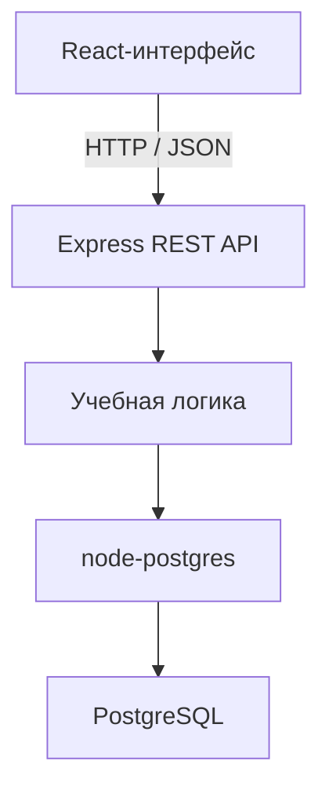

# PolySQL

**PolySQL** — full-stack веб-платформа для последовательного изучения PostgreSQL и основ работы с реляционными базами данных.

Пользователь может изучать теоретические материалы, проходить тесты, получать пояснения к ответам, выполнять практические задания и отслеживать общий прогресс обучения. Для преподавателей и администраторов предусмотрены отдельные интерфейсы для управления учебными материалами, пользователями и ролями.

Проект объединяет клиентскую часть на **React**, REST API на **Node.js и Express** и базу данных **PostgreSQL**.

> Проект представляет собой функциональный учебный прототип и продолжает развиваться. Некоторые административные и практические сценарии пока реализованы частично.

---

## Основные возможности

### Для обучающегося

- регистрация и вход в систему;
- просмотр структурированного списка тем;
- изучение теоретических материалов по PostgreSQL;
- прохождение тестов после каждой темы;
- автоматическая проверка выбранных ответов;
- подсветка правильных и ошибочных вариантов;
- вывод пояснений к ответам;
- сохранение результатов тестирования;
- отображение выполненных тем;
- расчёт общего прогресса обучения;
- просмотр практических заданий и примеров возможных решений;
- личный профиль со статистикой.

### Для преподавателя и администратора

- добавление новых тем;
- создание тестовых вопросов;
- добавление вариантов и правильных ответов;
- создание практических заданий;
- просмотр пользователей;
- назначение и изменение ролей;
- прототип интерфейса проверки работ обучающихся.

---

## Программа курса

Материалы платформы охватывают путь от базовых понятий до более сложных возможностей PostgreSQL:

- назначение баз данных и СУБД;
- основы PostgreSQL;
- создание таблиц;
- типы данных и ограничения;
- простые SQL-запросы;
- работа со связанными таблицами;
- индексы;
- транзакции;
- сложные SQL-конструкции;
- рекурсивные запросы.

Каждая учебная тема может включать:

1. теоретический материал;
2. дополнительные материалы или презентацию;
3. тест с вариантами ответов;
4. пояснения к ответам;
5. практические задания.

---

## Технологический стек

### Клиентская часть

- **React 17**
- **React Router 6**
- JavaScript
- Create React App
- CRACO
- React Helmet
- DOMPurify
- js-cookie
- CSS и CSS Modules
- Fetch API

### Серверная часть

- **Node.js 18**
- **Express 4**
- REST API
- node-postgres (`pg`)
- cookie-parser
- body-parser
- CORS

### Хранение данных

- **PostgreSQL**
- параметризованные SQL-запросы;
- агрегатные функции;
- Common Table Expressions;
- `JOIN`;
- `BOOL_AND`;
- `ON CONFLICT DO UPDATE`;
- связи между пользователями, темами, заданиями и результатами.

---

## Архитектура приложения

Приложение состоит из React-интерфейса, Express-сервера и PostgreSQL. Клиент обращается к REST API, сервер выполняет бизнес-логику и параметризованные SQL-запросы, а база данных хранит учебные материалы, пользователей и результаты обучения.



Основные уровни приложения:

1. **Views** — страницы главной, обучения, регистрации и профиля.
2. **UI-компоненты** — формы, панели тем, тесты, задания и элементы навигации.
3. **REST API** — регистрация, авторизация, загрузка материалов и сохранение прогресса.
4. **SQL-запросы** — работа с учебными данными и результатами пользователей.
5. **PostgreSQL** — постоянное хранение данных.

---

## Как устроен процесс обучения

### Выбор темы

Клиент получает список тем через API. Для авторизованного пользователя сервер одновременно вычисляет статус каждой темы на основании выполненных тестовых заданий.

### Изучение теории

Теоретические материалы хранятся в PostgreSQL и выводятся на странице выбранной темы. Перед отображением HTML очищается с помощью **DOMPurify**.

### Прохождение теста

Для выбранной темы сервер возвращает вопросы и варианты ответов. После отправки теста:

1. ответы сравниваются с правильными вариантами;
2. вычисляется число правильных ответов;
3. результат каждого задания сохраняется в `completed_tasks`;
4. пользователь получает визуальную обратную связь и пояснения.

### Расчёт прогресса

Тема считается завершённой, когда пользователь правильно выполнил все связанные с ней тестовые задания.

```text
прогресс = количество завершённых тем / общее количество тем × 100%
```

Для расчёта на сервере используется CTE и агрегатная функция `BOOL_AND`.

### Практические задания

Для темы могут быть добавлены задания на составление SQL-запросов и примеры возможных решений. Интерфейс ввода запроса уже реализован, однако полноценное безопасное выполнение пользовательского SQL на сервере пока требует доработки.

---

## Роли пользователей

Интерфейс приложения меняется в зависимости от роли пользователя.

| Роль | Возможности |
|---|---|
| Обучающийся | Изучение тем, тестирование, практика и просмотр прогресса |
| Преподаватель | Просмотр учебной статистики и прототип проверки работ |
| Администратор | Управление материалами, пользователями и ролями |

В текущей версии роли определяются через cookies и используются для условного отображения разделов профиля.

---

## REST API

Сервер локально запускается по адресу:

```text
http://localhost:5009
```

### Пользователи

| Метод | Endpoint | Назначение |
|---|---|---|
| `POST` | `/api/register` | Зарегистрировать пользователя |
| `POST` | `/api/login` | Выполнить вход |
| `GET` | `/api/rolesPanel` | Получить пользователей и их роли |
| `GET` | `/api/rolesList` | Получить список ролей |
| `POST` | `/api/updateRoles` | Изменить роли пользователей |

### Учебные материалы

| Метод | Endpoint | Назначение |
|---|---|---|
| `GET` | `/api/themes` | Получить темы и их статус |
| `GET` | `/api/questions` | Получить вопросы выбранной темы |
| `GET` | `/api/correct-answers` | Получить правильные ответы |
| `GET` | `/api/explanations` | Получить пояснения к ответам |
| `GET` | `/api/get-practice` | Получить практические задания |
| `POST` | `/api/admin/add` | Добавить тему, вопрос или практику |

### Результаты обучения

| Метод | Endpoint | Назначение |
|---|---|---|
| `POST` | `/api/submit-answers` | Проверить и сохранить ответы |
| `GET` | `/api/user-progress` | Получить прогресс пользователя |

---

## Модель данных

Основные таблицы приложения:

- `users` — пользователи;
- `roles` — доступные роли;
- `theory` — темы и теоретические материалы;
- `tasks` — тестовые вопросы;
- `answers` — варианты ответов;
- `correct_answers` — правильные ответы;
- `explanation_answers` — пояснения к вариантам;
- `practice` — практические задания;
- `completed_tasks` — результаты пользователей.

Основные связи:

- пользователь имеет одну роль;
- тема содержит несколько тестовых и практических заданий;
- тестовый вопрос имеет несколько вариантов ответа;
- пользователь может выполнить множество заданий;
- результат связывает пользователя с конкретным тестовым заданием.

---

## Структура проекта

```text
PolySQL/
├── backend/
│   ├── server.js              # Express API и SQL-запросы
│   └── dbconfig.js            # Подключение к PostgreSQL
├── public/                    # Статические ресурсы
├── src/
│   ├── components/
│   │   ├── layout/            # Крупные блоки страниц
│   │   ├── shared/            # Общие ресурсы
│   │   └── UI/                # Переиспользуемые UI-компоненты
│   ├── views/
│   │   ├── home/              # Главная страница
│   │   ├── tasks/             # Обучение и тестирование
│   │   ├── profile/           # Профиль и панели управления
│   │   └── registration/      # Вход и регистрация
│   ├── index.js               # Маршрутизация приложения
│   └── style.css              # Общие стили
├── craco.config.js            # Прокси на локальный API
└── package.json               # Зависимости и команды
```

---

## Локальный запуск

### Требования

- Node.js 18;
- npm;
- PostgreSQL.

### 1. Клонирование и установка

```bash
git clone https://github.com/Gonerr/PolySQL.git
cd PolySQL
npm install
```

### 2. Настройка PostgreSQL

Укажите параметры собственной PostgreSQL в:

```text
backend/dbconfig.js
```

Сервер ожидает схему `users` и таблицы, перечисленные в разделе «Модель данных».

> В текущей версии репозитория нет миграций или готового SQL-скрипта для автоматического создания структуры базы данных. Их добавление входит в планы развития.

### 3. Запуск приложения

```bash
npm start
```

Команда одновременно запускает:

- React-интерфейс — `http://localhost:3000`;
- Express API — `http://localhost:5009`.

---

## Реализованные технические решения

В ходе разработки проекта были реализованы:

- full-stack-взаимодействие React, Express и PostgreSQL;
- REST API для работы с учебными материалами;
- регистрация и вход пользователей;
- ролевое отображение интерфейса;
- параметризованные SQL-запросы;
- хранение теории и заданий в базе данных;
- автоматическая проверка тестов;
- сохранение индивидуальных результатов;
- вычисление прогресса сложным SQL-запросом;
- добавление материалов через административную панель;
- изменение ролей пользователей;
- очистка HTML перед отображением;
- адаптивная компоновка учебной страницы;
- одновременный запуск frontend и backend одной командой.

---

## Текущее состояние и планы развития

Проект является учебной full-stack-платформой и требует дополнительной подготовки перед production-развёртыванием.

Приоритетные улучшения:

- вынести параметры PostgreSQL и секреты в переменные окружения;
- добавить `.env.example`;
- удалить учётные данные из истории репозитория и заменить скомпрометированные пароли;
- хранить пароли только в виде безопасных хешей;
- перейти на защищённые `HttpOnly` cookies или полноценную токен-сессию;
- добавить серверную проверку ролей для административных endpoint;
- ограничить и настроить CORS;
- добавить SQL-миграции и демонстрационные данные;
- реализовать безопасную песочницу для выполнения учебных SQL-запросов;
- подключить кабинет преподавателя к реальным данным;
- завершить серверное сохранение проверок практических работ;
- добавить валидацию запросов и централизованную обработку ошибок;
- покрыть API и учебную логику автоматическими тестами;
- подготовить Docker Compose для приложения и PostgreSQL;
- настроить полноценное развёртывание frontend и backend.

---

## Автор

**Анастасия Лихачева**

Проект разработан как учебная full-stack-система для практического изучения веб-разработки, проектирования баз данных, SQL и создания электронных образовательных ресурсов.
